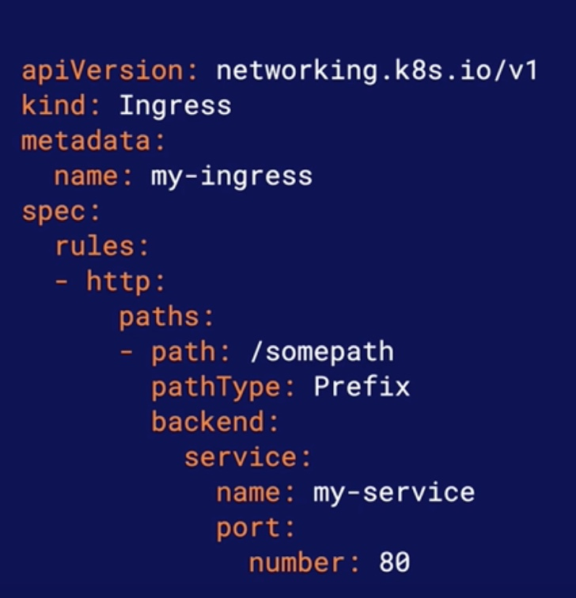
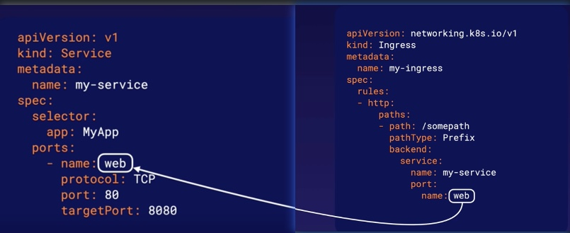

# Managing Access from Outside with K8s Ingress
## What is ingress
An ingress is a kubernetes object that manages external access to Services in the cluster

An ingress is capable of providing more functionality than a simple NodePort Service, such as
* SSL termination
* Advanced load balancing 
* Name based virtual hosting

## Ingress Controller
To get ingress object to work, you must install one or more `ingress controllers`

## Routing to a service
Ingress define a set of routing rules.

Each rule has a set of paths, each with a backend. Requests matching a path will be routed to its associated backend

## Routing to a service with a name port
If a Service uses a `named port`, an ingress can also use the port's name to choose to which port it will route
