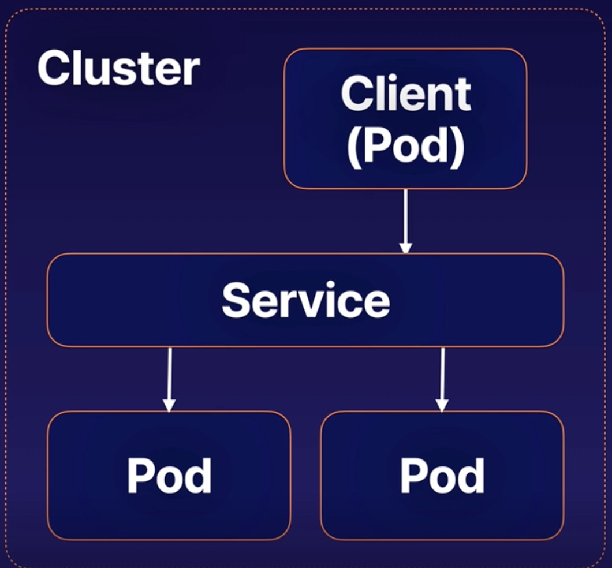
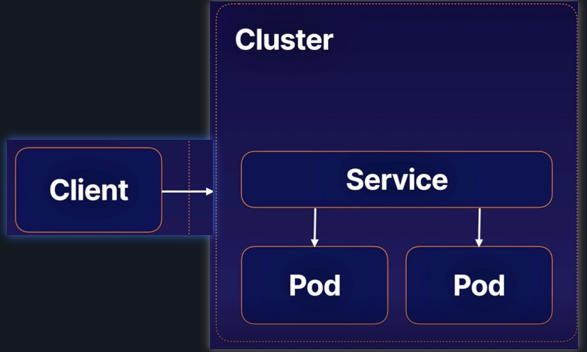
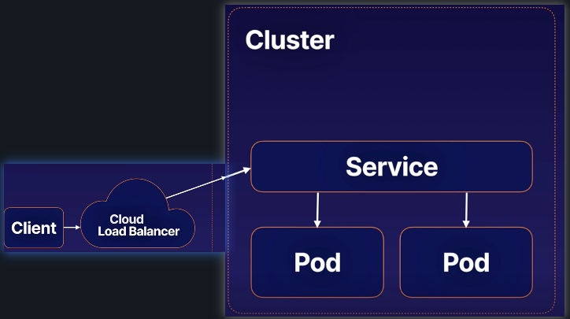

# Using k8s service
## Service Types
The service type determines how and where the service will be expose your application. 

## ClusterIP Services
ClusterIP expose applications inside the cluster network. 

Use ClusterIP when your client will be other pods within the cluster

## NodePort Services
NodePort expose applications outside the cluster network.

Use the NodePort when applications or users will be accessing your application from outside the cluster

## LoadBalancer Services
LoadBalancer Services also expose applications outside  the cluster network, but they use an external cloud load balancer

## ExternalName (Outside the scope of CKA)
