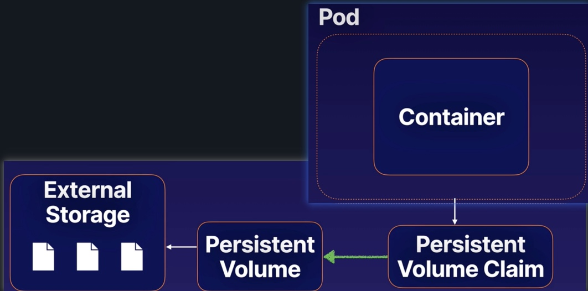

# Kubernetes Storage Overview
## Container File System
The container file system is ephemeral.

## Volumes
`Volumes` allow you to store data outside the container file system while allowing the container to access the data at runtime

`Persistent Volumes` allow you to treat storage as an abstract resource and consume it using your pods 

