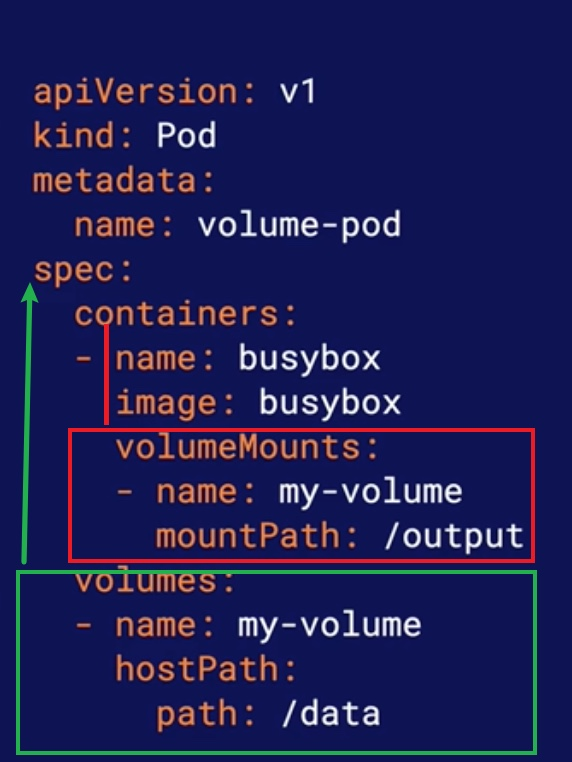
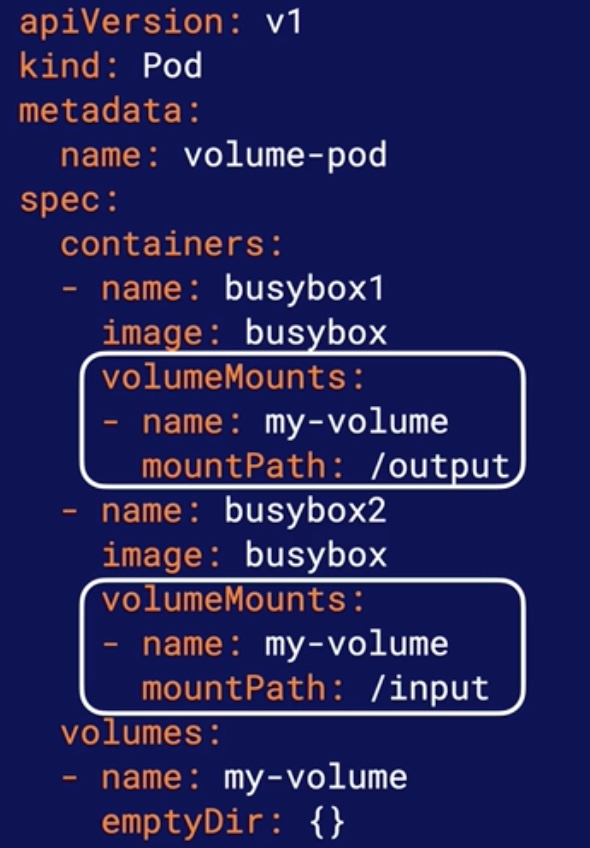

# Using Kubernetes Volumes
## Volumes and volumeMounts
1. volumes
* It is a Pod spec, not a container spec
* Specify the storage volumes available to the pod

2. volumeMount:
* It is a Container spec
* Reference the volumes in the Pod spec and provide a mount ptah

## Sharing Volumes between containers
You can use volumeMounts to mount the same volume to multiple containers within the same pod.

## Common Volume Type
* `hostPath`: stores data in a specific directory on the k8s node
* `emptyDir`: stores date in a dynamically created location on the node. This volume type is very useful for simply sharing data between containers in the same pod