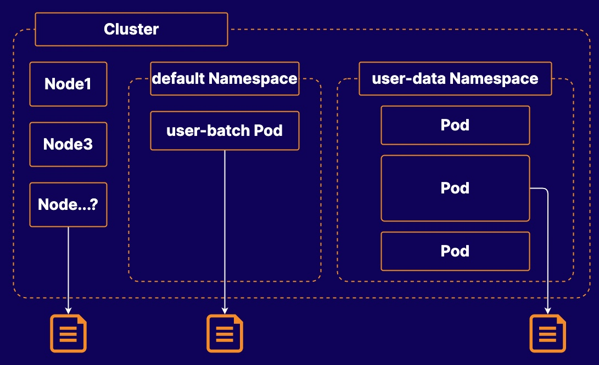

# Practice Exam 1 - Object Management

## Objectives
1. Count the number of nodes that are ready to run normal workloads
2. Retrieve error messages from a container log
3. Find the Pod utilizing the most CPU within a namespace


## Count the Number of Nodes That Are Ready to Run Normal Workloads
1. Count the number of nodes ready to run a normal workload:
```bash
kubectl get nodes

NAME             STATUS   ROLES                  AGE   VERSION
acgk8s-control   Ready    control-plane,master   72m   v1.23.0
acgk8s-worker1   Ready    <none>                 72m   v1.23.0
acgk8s-worker2   Ready    <none>                 72m   v1.23.0
```

2. Check that the worker nodes can run normal workloads:
```bash
kubectl describe node  acgk8s-worker1|grep Taints

Taints:             <none>

kubectl describe node  acgk8s-worker2|grep Taints
```

3. Save this number to the file /k8s/0001/count.txt:
```bash
echo 2 > /k8s/0001/count.txt
```

## Retrieve Error Messages from a Container Log
1. Obtain error messages from a container's log:
```bash
kubectl logs -n backend data-handler -c proc
```

2. Get the error message and save this output to the file /k8s/0002/errors.txt:
```bash
kubectl logs -n backend data-handler -c proc|grep ERROR > /k8s/0002/errors.txt
```

## Find the pod with a label of app=auth in the web namespace that Is utilizing the most CPU.
1. Print out the pod load
```bash
kubectl top pod -n web --sort-by cpu --selector app=auth

NAME       CPU(cores)   MEMORY(bytes)   
auth-web   100m         6Mi             
auth1      0m           0Mi             
auth2      0m           0Mi    
```
2. Save the result
```bash
echo auth-web >/k8s/0003/cpu-pod.txt
```


