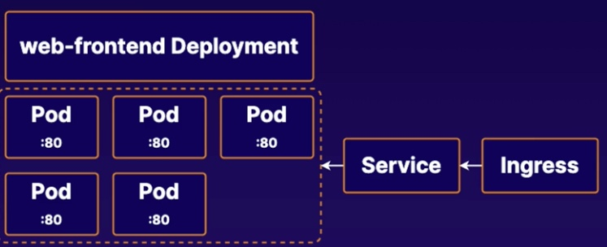

# Practice Exam 2 - Deployment and Service

## Objective
* Edit the web-frontend deployment to expose the HTTP port
* Create a service to expose the web-fronted pod
* Scale the web-fronted deployment up
* Create an ingress that map to new services

## Edit the Web Frontend Deployment to Expose the HTTP Port
1. Edit the web-frontend deployment in the web namespace:
```bash
kubectl edit deployment web-frontend -n web
```
2. Change the Pod template to expose port 80 on our NGINX containers:
```yml
spec:
  containers:
  - image: nginx:1.14.2
    ports:
    - containerPort: 80
```

## Create a Service to Expose the Web Frontend Deployment's Pods Externally
1. Create web-fronted-svc
```yml
# sudo vi web-fronted-svc.yml
apiVersion: v1
kind: Service
metadata:
  name: web-frontend-svc
  namespace: web
spec:
  type: NodePort
  selector:
    # get this name from deployment
    # app.kubernetes.io/name: MyApp
    app: web-frontend
  ports:
      # By default and for convenience, the `targetPort` is set to the same value as the `port` field.
    - port: 80
      targetPort: 80
      # Optional field
      # By default and for convenience, the Kubernetes control plane will allocate a port from a range (default: 30000-32767)
      nodePort: 30080
```

## Scale Up the Web Frontend Deployment
1. Scale up the deployment:
```bash
kubectl scale deployment web-frontend -n web --replicas=5
```

## Create an Ingress That Maps to the New Service
1. Create web-frontend-ingress
```yml
# sudo vi web-frontend-ingress.yml
apiVersion: networking.k8s.io/v1
kind: Ingress
metadata:
  name: web-frontend-ingress
  namespace: web
  #annotations:
  #  nginx.ingress.kubernetes.io/rewrite-target: /
spec:
  #ingressClassName: nginx-example
  rules:
  - http:
      paths:
      - path: /testpath
        pathType: Prefix
        backend:
          service:
            name: web-frontend-svc
            port:
              number: 80
```

## Reference
* [Type NodePort](https://kubernetes.io/docs/concepts/services-networking/service/)
* [Scaling a Deployment](https://kubernetes.io/docs/concepts/workloads/controllers/deployment/#scaling-a-deployment)
* [The Ingress resource](https://kubernetes.io/docs/concepts/services-networking/ingress/)