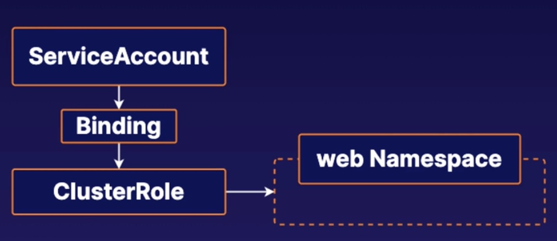

# Practice Exam 3 - Managing K8s Role-Based Access Control (RBAC)


## Objective
* Create a Service Account
* Create a ClusterRole That Provides Read Access to Pods
* Bind the ClusterRole to the Service Account to Only Read Pods in the web Namespace

## Create a Service Account
```bash
kubectl create sa  webautomation -n web
```

## Create a ClusterRole That Provides Read Access to Pods
```yml
# sudo vi pod-reader.yml
apiVersion: rbac.authorization.k8s.io/v1
kind: ClusterRole
metadata:
  # "namespace" omitted since ClusterRoles are not namespaced
  name: pod-reader
  namespace: web
rules:
- apiGroups: [""]
  #
  # at the HTTP level, the name of the resource for accessing Secret
  # objects is "pods"
  resources: ["pods"]
  verbs: ["get", "watch", "list"]
```

## Bind the ClusterRole to the Service Account to Only Read Pods in the web Namespace
```yml
# sudo vi rb-pod-reader.yml

apiVersion: rbac.authorization.k8s.io/v1
# This cluster role binding allows the service acount webautomation to read secrets in any namespace.
kind: ClusterRoleBinding
metadata:
  name: rb-pod-reader
  namespace: web
subjects:
- kind: ServiceAccount
  name: webautomation
  namespace: web
  # not applicable for a SA
  # apiGroup: rbac.authorization.k8s.io
roleRef:
  kind: ClusterRole
  name: pod-reader
  apiGroup: rbac.authorization.k8s.io
```

## Reference
* [Using RBAC Authorization:RoleBinding and ClusterRoleBinding](https://kubernetes.io/docs/reference/access-authn-authz/rbac/#role-binding-examples)
* [Using RBAC Authorization:RoleBinding examples](https://kubernetes.io/docs/reference/access-authn-authz/rbac/#role-binding-examples)