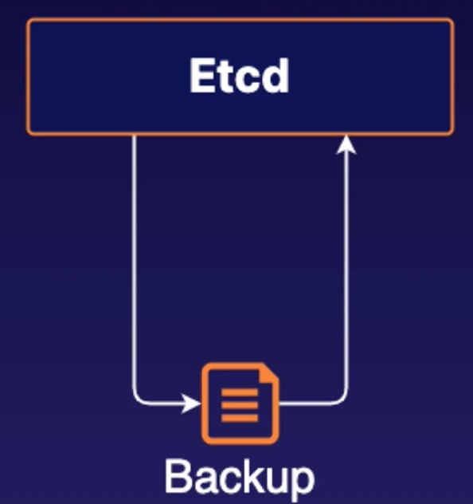

# Practice Exam 4 - etcd

## Objective
* Back Up the etcd Data
* Restore the etcd Data from the Backup

## Back Up the etcd Data
1. login to the etcd server
```bash
ssh etcd1
```

```bash
# sudo ETCDCTL_API=3 etcdctl --endpoints=https://<etcd ip address>:2379 --cacert=<trusted-ca-file> --cert=<cert-file> --key=<key-file> snapshot save <backup-file-location>

sudo ETCDCTL_API=3 etcdctl --endpoints=https://10.0.1.102:2379 --cacert=/home/cloud_user/etcd-certs/etcd-ca.pem  --cert=/home/cloud_user/etcd-certs/etcd-server.crt --key=/home/cloud_user/etcd-certs/etcd-server.key snapshot save /home/cloud_user/etcd_backup.db
```

## Restore the etcd Data from the Backup
1. Delete the existing etcd data
```bash
sudo systemctl stop etcd

sudo rm -rf /var/lib/etcd
```

2. Restore etcd data from a backup:
This restore command actually spin up a temporary etcd cluster and output the data from backup file into the appropriate etcd cluster
```bash
# solution by ACG
sudo ETCDCTL_API=3 etcdctl snapshot restore /home/cloud_user/etcd_backup.db \
--initial-cluster etcd-restore=https://10.0.1.102:2380 \
--initial-advertise-peer-urls https://10.0.1.102:2380 \
--name etcd-restore \
--data-dir /var/lib/etcd

# Solution from the official website
sudo ETCDCTL_API=3 etcdctl --endpoints 10.0.1.102:2379 \
snapshot restore etcd_backup.db \
--data-dir /var/lib/etcd
```


3. (optional)Set database ownership to make sure `/var/lib/etcd` is owned by etcd
```bash
sudo chown -R etcd:etcd /var/lib/etcd
```

4. Restart etcd:
```bash
sudo systemctl start etcd
```
5. Verify the system is working:
```bash
ETCDCTL_API=3 etcdctl get cluster.name \
--endpoints=https://10.0.1.102:2379 \
--cacert=/home/cloud_user/etcd-certs/etcd-ca.pem \
--cert=/home/cloud_user/etcd-certs/etcd-server.crt \
--key=/home/cloud_user/etcd-certs/etcd-server.key
```

## Reference
* [Operating etcd clusters for Kubernetes-Built-in snapshot](https://kubernetes.io/docs/tasks/administer-cluster/configure-upgrade-etcd/#securing-communication)
* [Operating etcd clusters for Kubernetes-Securing communication](https://kubernetes.io/docs/tasks/administer-cluster/configure-upgrade-etcd/#securing-communication)
