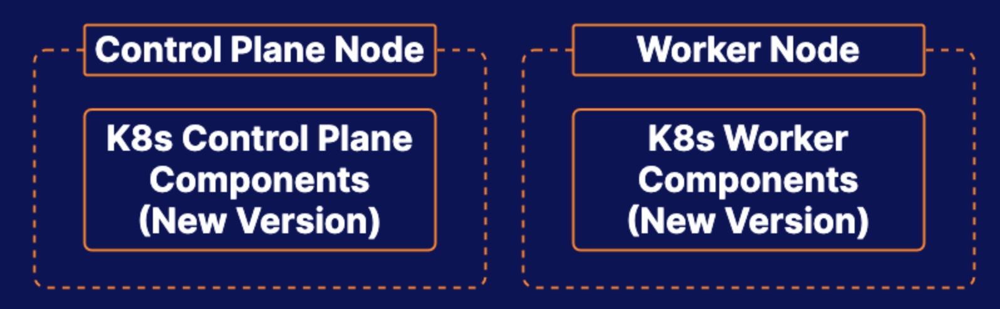

# Practice Exam 5 - Cluster Management

## Objective
* Upgrade All Kubernetes Components on the Control Plane Node
* Upgrade All Kubernetes Components on the Worker Node

## Upgrade All Kubernetes Components on the Control Plane Node
0. Preparation
```bash
sudo apt update
sudo apt-cache madison kubeadm
# find the latest 1.23 version in the list
# it should look like 1.23.x-00, where x is the latest patch
```

1. Upgrade kubeadm:
```bash
sudo apt-mark unhold kubeadm
sudo apt update
sudo apt-get install -y kubeadm=1.22.2-00
sudo apt-mark hold kubeadm
sudo kubeadm version
```

2. Verify the upgrade plan
```bash
sudo kubeadm upgrade plan
```

3. Drain the control plane node:
```bash
kubectl drain acgk8s-control --ignore-daemonsets
```

4. Apply the upgrade:
```bash
sudo kubeadm upgrade apply v1.22.2
```

5. Upgrade kubelet and kubect
```bash
sudo apt-get update
sudo apt-get install -y --allow-change-held-packages kubelet=1.22.2-00 kubectl=1.22.2-00
```

6. Restart the kubelet:
```bash
sudo systemctl daemon-reload
sudo systemctl restart kubelet
```
7. Uncordon the control plane node:
```bash
kubectl uncordon acgk8s-control
```


## Upgrade All Kubernetes Components on the Worker Node
1. Upgrade kubeadm:
```bash
ssh acgk8s-worker1

sudo apt-mark unhold kubeadm
sudo apt-get update
sudo apt-get install -y --allow-change-held-packages kubeadm=1.22.2-00
sudo apt-mark hold kubeadm
sudo kubeadm version
```

2. Upgrade the node:
```bash
sudo kubeadm upgrade node
```

3. Drain the worker1 node from master node:
```bash
kubectl drain acgk8s-worker1 --ignore-daemonsets --force
```

4.Upgrade kubelet and kubectl
```bash
sudo apt-get update
sudo apt-get install -y --allow-change-held-packages kubelet=1.22.2-00 kubectl=1.22.2-00
```
5. Restart kubelet:
```bash
sudo systemctl daemon-reload
sudo systemctl restart kubelet
```

6. Uncordon the worker node from the master:
```bash
kubectl uncordon acgk8s-worker1
```