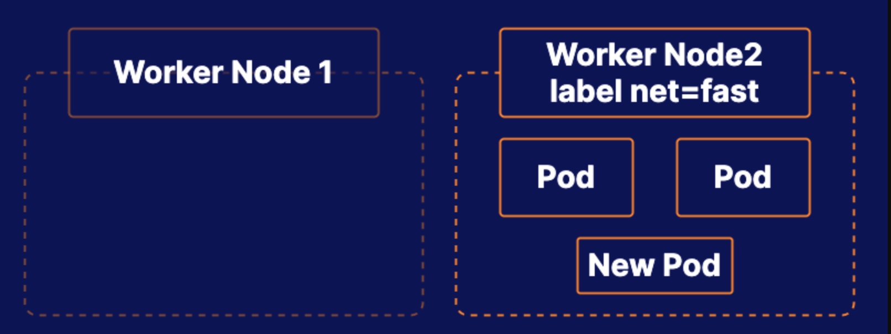

# Practice Exam 6 - Scheduling

## Objective
* Drain the Worker1 Node
* Create a Pod That Will Only Be Scheduled on Nodes with a Specific Label

## Drain the Worker1 Node
```bash
kubectl drain acgk8s-worker1 --delete-local-data --ignore-daemonsets --force
```

## Create a Pod That Will Only Be Scheduled on Nodes with a Specific Label
1. Label the target node
```bash
kubectl label nodes acgk8s-worker2 disk=fast
```

2. View the current label
```bash
kubectl get nodes --show-labels
```

3. Create a pod
```yml
# sudo vim fast-nginx.yml
apiVersion: v1
kind: Pod
metadata:
  name: fast-nginx
  namespace: dev
spec:
  containers:
  - name: nginx
    image: nginx
    imagePullPolicy: IfNotPresent
  nodeSelector:
    disk: fast
```

## Reference
* [Assign Pods to Nodes](https://kubernetes.io/docs/tasks/configure-pod-container/assign-pods-nodes/)