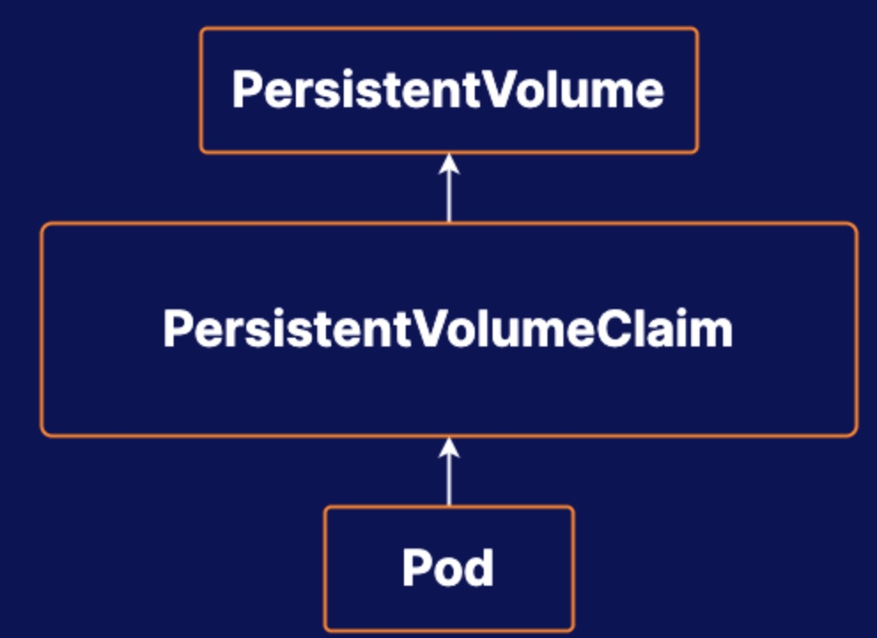

# Practice Exam 7 - Storage

## Objective
* Create a PersistentVolume
* Create a Pod that uses the PersistentVolume for Storage
* Expand the Pod's PersistentVolume

## Create a PersistentVolume
1. Create a StorageClass using local disk. Set field `allowVolumeExpansion` to true.
```yml
# sudo vi localdisk-sc.yml
apiVersion: storage.k8s.io/v1
kind: StorageClass
metadata:
  name: local-storage
provisioner: kubernetes.io/no-provisioner
allowVolumeExpansion: true
```

2. Create a Persistent Volume
```yml
# sudo vim host-storage-pv.yml
apiVersion: v1
kind: PersistentVolume
metadata:
  name: host-storage-pv
spec:
  storageClassName: local-storage
  capacity:
    storage: 1Gi
  accessModes:
    - ReadWriteOnce
  hostPath:
    path: "/mnt/data"
```

## Create a Pod That Uses the PersistentVolume for Storage
1. Create a Persistent Volume Claim
```yml
# sudo vim host-storage-pvc.yml
apiVersion: v1
kind: PersistentVolumeClaim
metadata:
  name: host-storage-pvc
  namespace: auth
spec:
  storageClassName: local-storage
  accessModes:
    - ReadWriteOnce
  resources:
    requests:
      storage: 100Mi
```

2. Create a Pod
```yml
# sudo vim host-storage-pod.yml
apiVersion: v1
kind: Pod
metadata:
  name: pv-pod
  namespace: auth
spec:
  volumes:
    - name: host-storage
      persistentVolumeClaim:
        claimName: host-storage-pvc
  containers:
    - name: task-pv-container
      image: nginx
      ports:
        - containerPort: 80
          name: "http-server"
      volumeMounts:
        - mountPath: "/usr/share/nginx/html"
          name: host-storage
```

## Expand the PersistentVolumeClaim
1. Modify the storage size in pvc to 200Mi
```bash
kubectl edit pvc host-storage-pvc -n auth
```
## Reference
[Configure a Pod to Use a PersistentVolume for Storage](https://kubernetes.io/docs/tasks/configure-pod-container/configure-persistent-volume-storage/#create-a-persistentvolume)