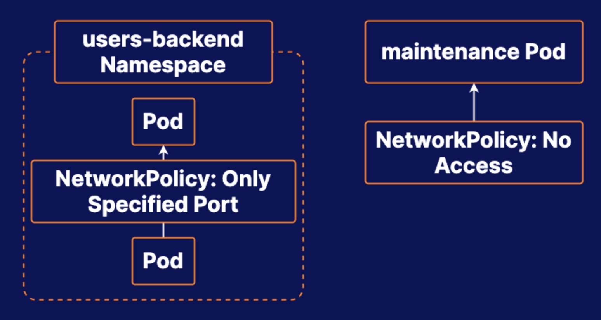

# Practice Exam 8 - Network Policy
## Target
1. Create a NetworkPolicy That Denies All Access to the Maintenance Pod
2. Create a NetworkPolicy That Allows All Pods in the Users-Backend Namespace to Communicate with Each Other Only on a Specific Port

## Key Points:
1. It is mandatory to specific `podSelector` even if there is no pod label.
2. You have to label the namespace before creating any network policy using namespaceSelector

## Create a NetworkPolicy That Denies All Access to the Maintenance Pod
1. Check the pod label
```bash
kubectl describe po maintenance -n foo

# Labels:       app=maintenance
```
2. Apply network policy to deny all traffic
```yml
# sudo vim np-maintenance.yml
apiVersion: networking.k8s.io/v1
kind: NetworkPolicy
metadata:
  name: np-maintenance
  namespace: foo
spec:
  podSelector:
    matchLabels:
      app: maintenance
  policyTypes:
    - Ingress
    - Egress
```

## Create a NetworkPolicy That Allows All Pods in the Users-Backend Namespace to Communicate with Each Other Only on a Specific Port
1. Add label to namespace
```bash
kubectl label namespace users-backend app=users-backend
```

2. Apply network policy to allow traffic between pod over port 80
```yml
sudo vim np-users-backend-80.yml
apiVersion: networking.k8s.io/v1
kind: NetworkPolicy
metadata:
  name: np-users-backend-80
  namespace: users-backend
spec:
  podSelector: {}
  policyTypes:
    - Ingress
    - Egress
  ingress:
    - from:
        - namespaceSelector:
            matchLabels:
              app: users-backend
      ports:
        - protocol: TCP
          port: 80
  egress:
    - to:
        - namespaceSelector:
            matchLabels:
              app: users-backend
      ports:
        - protocol: TCP
          port: 80

```

## Reference
* [Network Policies](https://kubernetes.io/docs/concepts/services-networking/network-policies/)