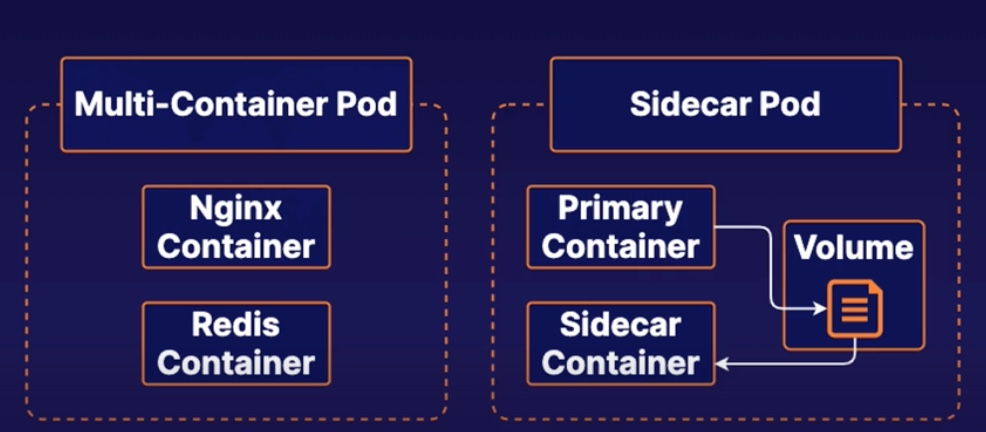

# Practice Exam 9 - Multi-container Pods

## Create a Multi-Container Pod
```yml
# sudo vi multi.yml
apiVersion: v1
kind: Pod
metadata:
  name: multi
  namespace: baz
spec:
  containers:
  - name: nginx
    image: nginx
    ports:
    - containerPort: 80
  - name: redis
    image: redis
```

## Create a Pod Which Uses a Sidecar to Expose the Main Container's Log File to `stdout`
```yml
# sudo vim logging-sidecar.yml
apiVersion: v1
kind: Pod
metadata:
  name: logging-sidecar
  namespace: baz
spec:
  restartPolicy: Never
  volumes:
  - name: shared-data
    emptyDir: {}

  containers:
  - name: busybox-container
    image: busybox
    volumeMounts:
    - name: shared-data
      mountPath: /pod-data
    command: ["/bin/sh"]
    args: ["-c", "echo Logging data > /pod-data/1.log"]

  - name: sidecar
    image: busybox
    volumeMounts:
    - name: shared-data
      mountPath: /usr/share
    command: ["/bin/sh"]
    args: ["-c", "tail -f  /usr/share/1.log"]
```

## Reference
* [Communicate Between Containers in the Same Pod Using a Shared Volume](https://kubernetes.io/docs/tasks/access-application-cluster/communicate-containers-same-pod-shared-volume/)