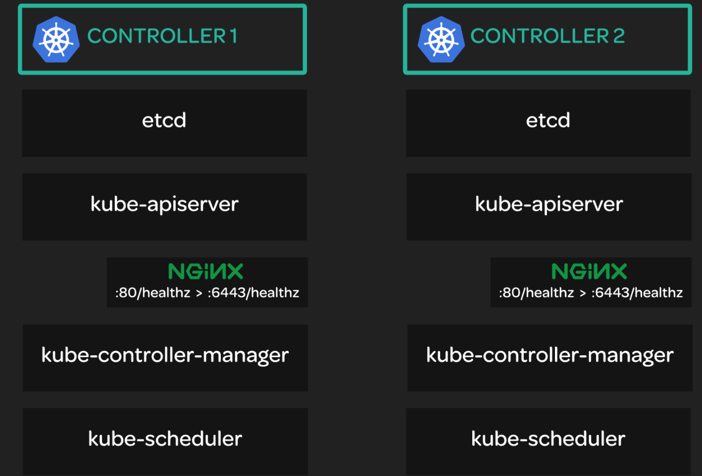

# Bootstrapping a Kubernetes Control Plane



## You will need to do the following:
Download and install the binaries.


## Download and install the binaries.

To accomplish this, you will need to download and install the binaries for kube-apiserver, kube-controller-manager, kube-scheduler, and kubectl. You can do so like this:
```bash
sudo mkdir -p /etc/kubernetes/config

wget -q --show-progress --https-only --timestamping \
  "https://storage.googleapis.com/kubernetes-release/release/v1.10.2/bin/linux/amd64/kube-apiserver" \
  "https://storage.googleapis.com/kubernetes-release/release/v1.10.2/bin/linux/amd64/kube-controller-manager" \
  "https://storage.googleapis.com/kubernetes-release/release/v1.10.2/bin/linux/amd64/kube-scheduler" \
  "https://storage.googleapis.com/kubernetes-release/release/v1.10.2/bin/linux/amd64/kubectl"

chmod +x kube-apiserver kube-controller-manager kube-scheduler kubectl

sudo mv kube-apiserver kube-controller-manager kube-scheduler kubectl /usr/local/bin/
```


Configure the kube-apiserver service.
To configure the kube-apiserver service, do the following:

sudo mkdir -p /var/lib/kubernetes/

sudo cp ca.pem ca-key.pem kubernetes-key.pem kubernetes.pem \
  service-account-key.pem service-account.pem \
  encryption-config.yaml /var/lib/kubernetes/

INTERNAL_IP=$(curl http://169.254.169.254/latest/meta-data/local-ipv4)
Set environment variables to contain the private IPs of both controller servers. Be sure to replace the placeholders with the actual private IPs:

ETCD_SERVER_0=<controller 0 private ip>

ETCD_SERVER_1=<controller 1 private ip>
Create the systemd unit file:

cat << EOF | sudo tee /etc/systemd/system/kube-apiserver.service
[Unit]
Description=Kubernetes API Server
Documentation=https://github.com/kubernetes/kubernetes

[Service]
ExecStart=/usr/local/bin/kube-apiserver \\
  --advertise-address=${INTERNAL_IP} \\
  --allow-privileged=true \\
  --apiserver-count=3 \\
  --audit-log-maxage=30 \\
  --audit-log-maxbackup=3 \\
  --audit-log-maxsize=100 \\
  --audit-log-path=/var/log/audit.log \\
  --authorization-mode=Node,RBAC \\
  --bind-address=0.0.0.0 \\
  --client-ca-file=/var/lib/kubernetes/ca.pem \\
  --enable-admission-plugins=Initializers,NamespaceLifecycle,NodeRestriction,LimitRanger,ServiceAccount,DefaultStorageClass,ResourceQuota \\
  --enable-swagger-ui=true \\
  --etcd-cafile=/var/lib/kubernetes/ca.pem \\
  --etcd-certfile=/var/lib/kubernetes/kubernetes.pem \\
  --etcd-keyfile=/var/lib/kubernetes/kubernetes-key.pem \\
  --etcd-servers=https://${ETCD_SERVER_0}:2379,https://${ETCD_SERVER_1}:2379 \\
  --event-ttl=1h \\
  --experimental-encryption-provider-config=/var/lib/kubernetes/encryption-config.yaml \\
  --kubelet-certificate-authority=/var/lib/kubernetes/ca.pem \\
  --kubelet-client-certificate=/var/lib/kubernetes/kubernetes.pem \\
  --kubelet-client-key=/var/lib/kubernetes/kubernetes-key.pem \\
  --kubelet-https=true \\
  --runtime-config=api/all \\
  --service-account-key-file=/var/lib/kubernetes/service-account.pem \\
  --service-cluster-ip-range=10.32.0.0/24 \\
  --service-node-port-range=30000-32767 \\
  --tls-cert-file=/var/lib/kubernetes/kubernetes.pem \\
  --tls-private-key-file=/var/lib/kubernetes/kubernetes-key.pem \\
  --v=2 \\
  --kubelet-preferred-address-types=InternalIP,InternalDNS,Hostname,ExternalIP,ExternalDNS
Restart=on-failure
RestartSec=5

[Install]
WantedBy=multi-user.target
EOF


