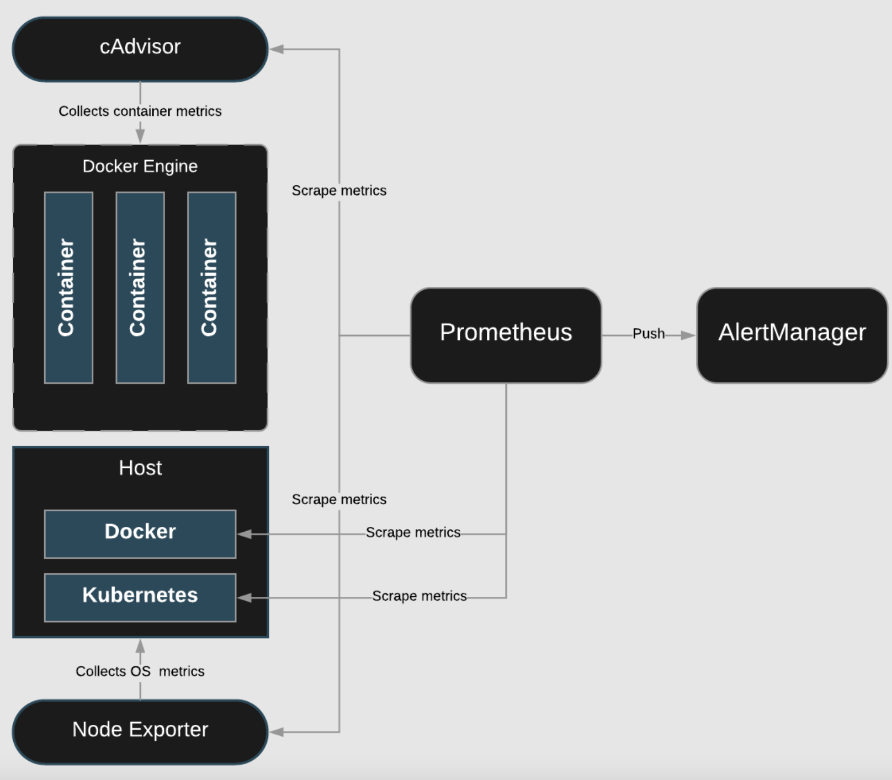
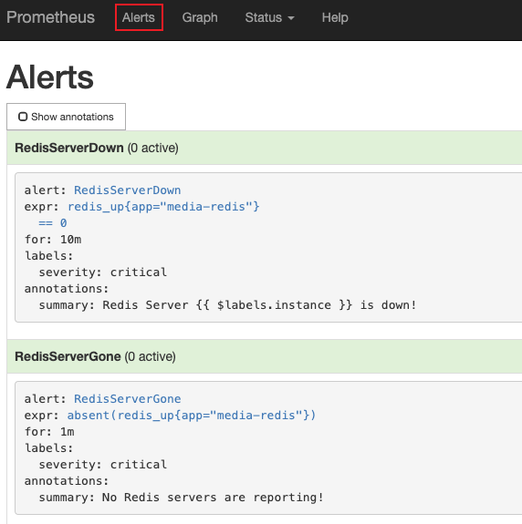

# Creating Alerting Rules



## You will need to do the following:
* Logging In and Setting up the Environment
* Create a ConfigMap That Will Be Used to Manage the Alerting Rules
* Test the rules


## Logging In and Setting up the Environment
```bash
sudo su -
cd /root/prometheus
./bootstrap.sh
kubectl get pods -n monitoring
```

## Create a ConfigMap That Will Be Used to Manage the Alerting Rules
```bash
vim prometheus-rules-config-map.yml
```
```yml
...
redis_alerts.yml: |
    groups:
    - name: redis_alerts
      rules:
      - alert: RedisServerDown
        expr: redis_up{app="media-redis"} == 0
        for: 10m
        labels:
          severity: critical
        annotations:
          summary: Redis Server {{ $labels.instance }} is down!
      - alert: RedisServerGone
        expr:  absent(redis_up{app="media-redis"})
        for: 1m
        labels:
          severity: critical
        annotations:
          summary: No Redis servers are reporting!
...
```
```bash
kubectl apply -f prometheus-rules-config-map.yml
```

## Test the rules
List the pods to find the name of the Prometheus pod:
```bash
kubectl get pods -n monitoring
```

Delete the Prometheus pod:
```bash
kubectl delete pods <POD_NAME> -n monitoring
```

In a new browser tab, navigate to the Expression browser:`http://<IP>:8080`

Click on the Alerts link to verify that the two Redis alerts are showing as green.

