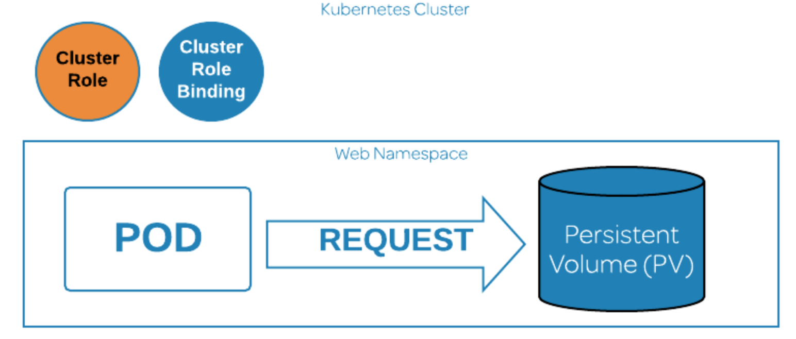

# Creating a ClusterRole to Access a PV in Kubernetes



## You will need to do the following:
* View the Persistent Volume
* Create a ClusterRoleBinding
* Create a Pod to Access the PV
* Request Access to the PV from the Pod

## View the Persistent Volume
```bash
kubectl get pv
```

## Create a ClusterRole
```bash
kubectl create clusterrole pv-reader --verb=get,list --resource=persistentvolumes

kubectl get clusterrole
```

## Create a ClusterRoleBinding
```bash
kubectl create clusterrolebinding pv-test --clusterrole=pv-reader --serviceaccount=web:default

cloud_user@ip-10-0-1-101:~$ kubectl get clusterrolebinding pv-test
```
## Create a Pod to Access the PV
```bash
nano curlpod.yaml
```
```yml
apiVersion: v1
kind: Pod
metadata:
  name: curlpod
  namespace: web
spec:
  containers:
  - image: curlimages/curl
    command: ["sleep", "9999999"]
    name: main
  - image: linuxacademycontent/kubectl-proxy
    name: proxy
  restartPolicy: Always
```
```bash
kubectl apply -f curlpod.yaml
```

## Request Access to the PV from the Pod
```bash
kubectl exec -it curlpod -n web -- sh

curl localhost:8001/api/v1/persistentvolumes
```
