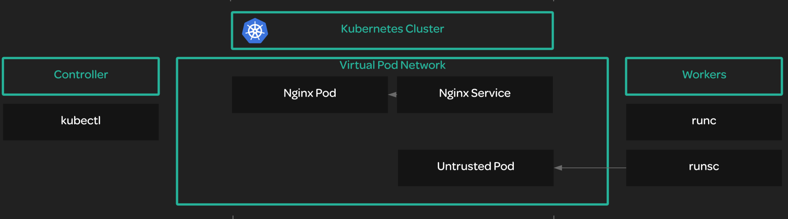

# Smoke Testing a Kubernetes Cluster



## You will need to do the following:
* Verify the cluster's ability to perform data encryption.
* Verify that deployments work.
* Verify that remote access works via port forwarding.
* Verify that you can access container logs with kubectl logs.
* Verify that you can execute commands inside a container with `kubectl exec`.
* Verify that services work.


## Verify the cluster's ability to perform data encryption.

The Kubernetes cluster has the ability to encrypt sensitive data. Create some sensitive data and verify that it is stored in an encrypted format.
```bash
kubectl create secret generic kubernetes-the-hard-way --from-literal="mykey=mydata"
```

Get the raw data from etcd, the output should be in an encrypted format
```bash
sudo ETCDCTL_API=3 etcdctl get \
  --endpoints=https://127.0.0.1:2379 \
  --cacert=/etc/etcd/ca.pem \
  --cert=/etc/etcd/kubernetes.pem \
  --key=/etc/etcd/kubernetes-key.pem\
  /registry/secrets/default/kubernetes-the-hard-way | hexdump -C
```

## Verify that deployments work.
```bash
kubectl run nginx --image=nginx

kubectl get pods -l run=nginx
```

## Verify that remote access works via port forwarding.
First, get the pod name of the Nginx pod and store it as an environment variable:
```bash
POD_NAME=$(kubectl get pods -l run=nginx -o jsonpath="{.items[0].metadata.name}")
```
Forward port 8081 to the Nginx pod:
```bash
kubectl port-forward $POD_NAME 8081:80
```

Open up a new terminal, log in to the controller server, and verify that the port forward works:
```bash
curl --head http://127.0.0.1:8081

# HTTP/1.1 200 OK
```

## Verify that you can access container logs with kubectl logs.
```bash
POD_NAME=$(kubectl get pods -l run=nginx -o jsonpath="{.items[0].metadata.name}")

kubectl logs $POD_NAME
```

## Verify that you can execute commands inside a container with `kubectl exec`.
```bash
POD_NAME=$(kubectl get pods -l run=nginx -o jsonpath="{.items[0].metadata.name}")

kubectl exec -ti $POD_NAME -- nginx -v

# nginx version: nginx/1.19.10
```

## Verify that services work.
Create a service to expose the Nginx deployment:
```bash
kubectl expose deployment nginx --port 80 --type NodePort

kubectl get svc nginx
```
Get the node port assigned to the newly created service and assign it to an environment variable:
```bash
NODE_PORT=$(kubectl get svc nginx --output=jsonpath='{range .spec.ports[0]}{.nodePort}')
```

Access the service on one of the worker nodes from the controller like this. 10.0.1.102 is the private IP of one of the workers:
```bash
curl -I 10.0.1.102:$NODE_PORT
# HTTP/1.1 200 OK

curl -I 10.0.1.103:$NODE_PORT
# HTTP/1.1 200 OK
```