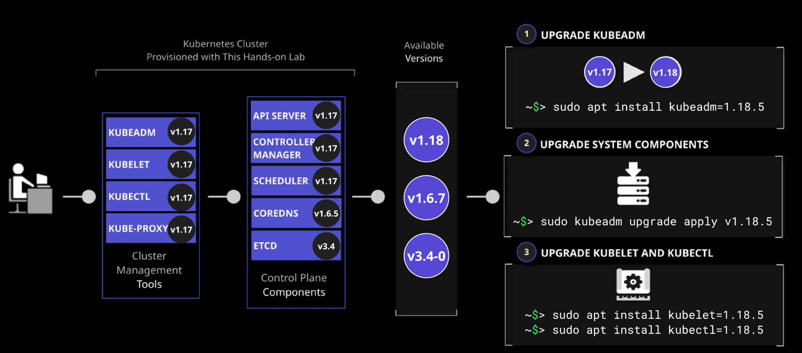
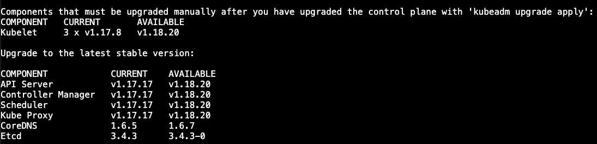

# Upgrading the Kubernetes Cluster Using kubeadm



## You will need to do the following:
* Install Version 1.18.5 of kubeadm
* Install the Latest Version of kubelet on the Master Node
* Install the Latest Version of kubectl on the Master Node


## Install Version 1.18.5 of kubeadm
1. On the master node, check the current version of kubeadm, then check for the Client Version and Server Version:
```bash
[master ]$ kubectl get nodes
[master ]$ kubectl version --short
```

2. Take the hold off of kubeadm and kubelet:
```bash
[master ]$ sudo apt-mark unhold kubeadm kubelet
```

3. Install them using the package manager:
```bash
[master ]$ sudo apt install -y kubeadm=1.18.5-00
```
4. Check the version again (which should show v1.18.5):
```bash
[master ]$ kubeadm version
```
5. Plan the upgrade to check for errors:
```bash
[master ]$ sudo kubeadm upgrade plan
```


6. Apply the upgrade of the kube-scheduler and kube-controller-manager:
```bash
[master ]$ sudo kubeadm upgrade apply v1.18.5
```

7. Look at what version our nodes are at:
```bash
[master ]$ kubectl get nodes

# ooh! the vnode version is still v.1.17
NAME            STATUS   ROLES    AGE   VERSION
ip-10-0-1-101   Ready    master   63m   v1.18.5
ip-10-0-1-102   Ready    <none>   63m   v1.17.8
ip-10-0-1-103   Ready    <none>   63m   v1.17.8

```

## Install the Latest Version of kubelet and kubectl on the Master Node
1. Make sure the package isn't on hold:
```bash
[master ]$ sudo apt-mark unhold kubelet, kubectl
```

2. Install the latest version of kubelet and kubectl:
```bash
[master ]$ sudo apt install -y kubelet=1.18.5-00
[master ]$ sudo apt install -y kubectl=1.18.5-00
```

3. Verify that the installation was successful:
```bash
[master ]$ kubectl get nodes

NAME            STATUS   ROLES    AGE   VERSION
ip-10-0-1-101   Ready    master   63m   v1.18.5
ip-10-0-1-102   Ready    <none>   63m   v1.17.8
ip-10-0-1-103   Ready    <none>   63m   v1.17.8
```

## Install the Newer Version of kubelet on the Worker Nodes
1. Make sure the kubelet package isn't on hold:
```bash
[worker ]$ sudo apt-mark unhold kubelet, kubectl
```

2. Install the latest version of kubelet:
```bash
[worker ]$ sudo apt install -y kubelet=1.18.5-00
[worker ]$ sudo apt install -y kubectl=1.18.5-00
```
