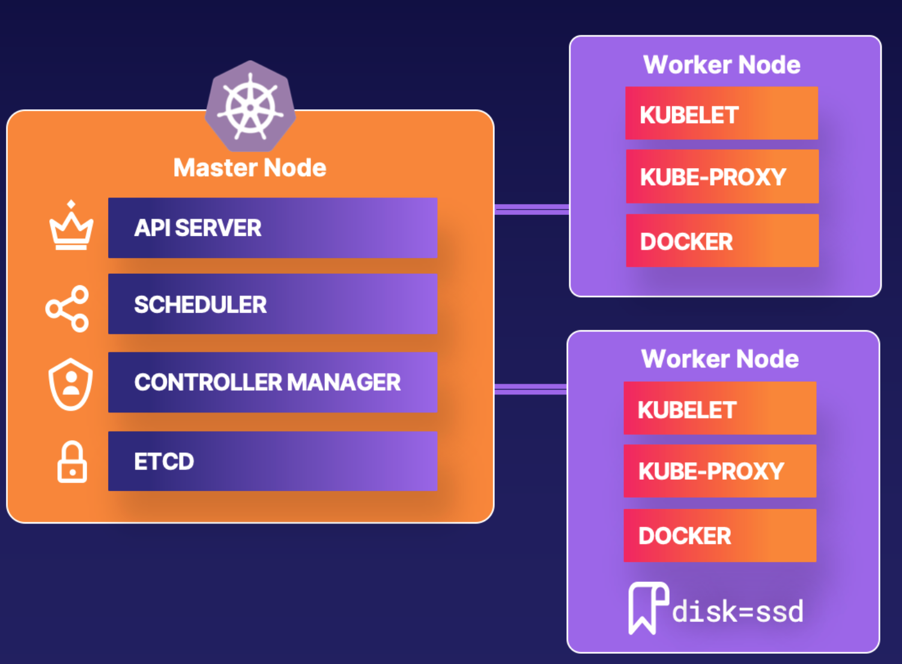

# Deploying a Pod to a Node with a Label in Kubernetes

## You will need to do the following:
* Get All Node Labels
* Create and Apply the Pod YAML
* Verify The pod is Running on the Correct Node


## Get All Node Labels
```bash
# node ip-10-0-1-102 is having the label disk=ssd
kubectl get nodes --show-labels
```
## Create and Apply the Pod YAML
```bash
```
```yml
apiVersion: v1
kind: Pod
metadata:
    name: nginx
spec:
    containers:
        - name: nginx
          image: nginx
    nodeSelector:
        disk: ssd
```

## Verify The pod is Running on the Correct Node
```bash
# verify if this pod is running on the node ip-10-0-1-102
get pods -o wide
```
