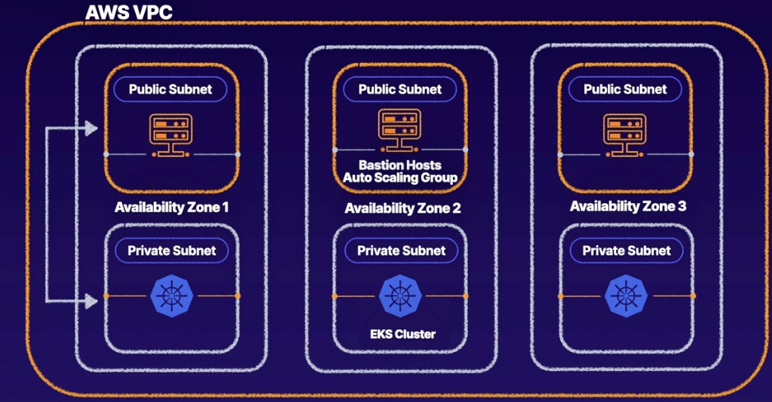

# Provisioning an EKS Cluster


## Terraform checklist
1. kubernetes.tf
2. eks-cluster.tf
3. vpv.tf
4. security-group.tf
5. version.tf
6. output.tf


## Config kubectl
1. Config kubectl
```bash
sudo aws eks --region $(terraform output -raw region) update-kubeconfig --name $(terraform output -raw cluster_name)
```

## Manage k8s cluster